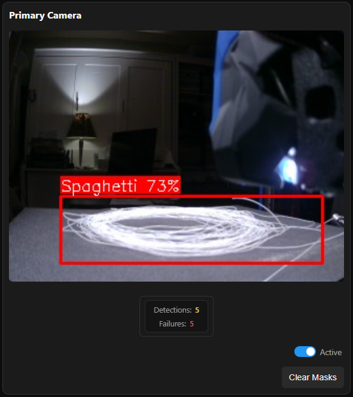
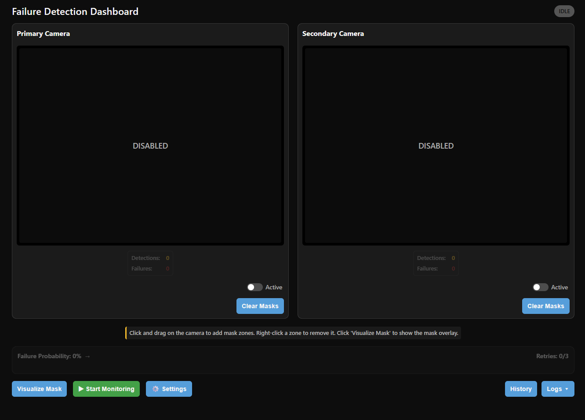
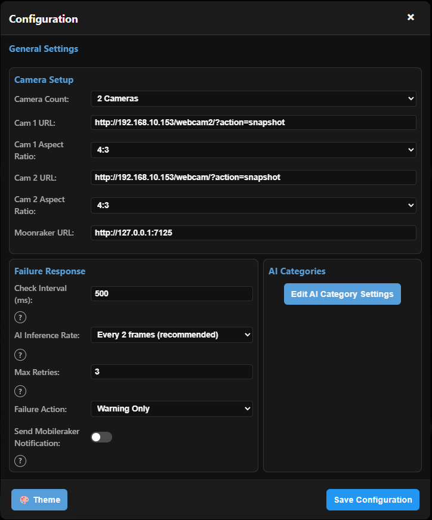
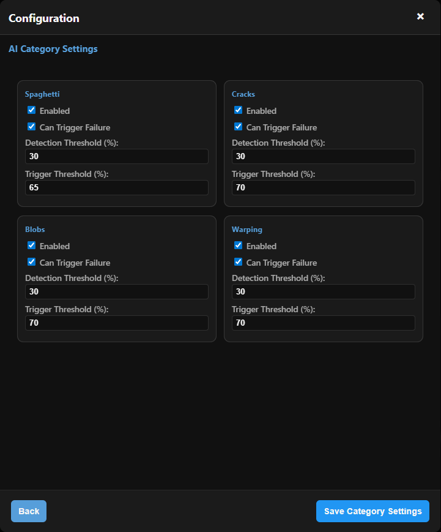

<h1 align="center">AI Print Failure Detection Plugin for Klipper/Mainsail</h1>

<p align="center">

</p/
## Local AI-Powered Failure Detection

This plugin uses an optimized TensorFlow Lite model to detect print failures in real time. It runs fully locally on your Klipper host, requires no cloud services, and directly integrates with Moonraker to pause or cancel prints automatically.

The plugin includes a complete monitoring dashboard with live camera feeds, visual failure overlays, multi-zone masking, and support for one or two cameras at once.

[AI Training Documentation](documents/AI_Training.md)

## Prerequisites

### Required:
- Crowsnest (camera functionality)
   - https://github.com/mainsail-crew/crowsnest
   
### Optional:
- Gcode Shell Commands (via kiauh; only needed for auto-start macro)
   - https://github.com/dw-0/kiauh/tree/master
- Mobileraker (phone notifications for triggered failures)
   - https://mobileraker.com/
   - https://github.com/Clon1998/mobileraker_companion

## Features

- **AI Failure Detection**: Uses a .tflite YOLO-based model to identify failures such as spaghetti, blobs, cracks, and warping.



<br><br>

- **Real-Time Web Dashboard**: View live camera feeds with bounding box overlays showing what the AI detects. The number of detections and failures for that session is also tracked below the respective camera. (Works on desktop and mobile)



<br><br>

- **Comprehensive Settings Menu**: Many configurable aspects to tailor the plugin to your printer and environment.



<br><br>

- **Multi-Camera Support**: Monitor and analyze up to two cameras simultaneously, each with its own prediction score and mask zones.
  
- **Dual Thresholds**:
   - **Detection Threshold** (yellow): highlights possible issues.
   - **Trigger Threshold** (red): automatically warns, pauses, or cancels the print after a configurable number of retries.

- **Configurable Actions**: Choose to warn only, pause, or cancel the print when a failure is detected.

- **Mobileraker Notifications**: If you have Mobileraker installed and custom notifications setup, you can enable automatic notifications for detected failures.

- **AI Detection Categories**: Choose what types of print failures you want to detect and whether or not they can trigger a failure.



<br><br>
  
- **Multi-Zone Masking System**:
   - Click-and-drag to define any number of mask rectangles directly on the camera feed.
   - Per-camera mask storage for dual-camera setups.
   - Masks hide irrelevant regions from AI analysis.
   - Right-click to delete individual zones.
   - “Clear Masks” button for quick resets.


<br><br>

- **Smart Idle Mode**: Automatically suspends AI processing when the printer is idle to reduce CPU usage.

- **Manual Start Button**: Starts AI monitoring process (useful for testing and finding ideal detection percentages).

- **Auto-Start Macro**: The provided macro can be inserted at the end of your `PRINT_START` to automatically enable the detection system (prevents high CPU usage during things like leveling and meshing).

- **Live Plugin Logs**: View the logs for the plugin on the main dashboard to check for functionality and see errors.

## Installation

Clone this repository to your printer and install:
   ```bash
   cd ~/klipper/klippy/extras/
   git clone https://github.com/CookiezRGood/klipper-print-failure-detection.git
   cd ~/klipper/klippy/extras/klipper-print-failure-detection
   sudo bash install.sh
   ```

## Automatic Updates

Add the following to your moonraker.conf to receive automatic updates:

```bash
[update_manager klipper-print-failure-detection]
type: git_repo
path: ~/klipper/klippy/extras/klipper-print-failure-detection
origin: https://github.com/CookiezRGood/klipper-print-failure-detection.git
install_script: install.sh
primary_branch: main
managed_services: klipper-print-failure-detection
```

## Post Installation Steps

- Open your browser and go to http://YOUR-IP:7126 to see the dashboard.
- Open the settings and input your printer camera(s) ip (used in crowsnest).
- Adjust any other settings to your preference with testing to make sure it works well for your setup.
   - The main testing you need to find is your ideal trigger threshold value. The detection threshold value can be anything as long as its lower than the detection threshold value.
- Add the following macros to your printer if you want to allow auto-starting of the plugin while printing:
   - Place the `ENABLE_AI_MONITOR` and `DISABLE_AI_MONITOR` macros at the end of your `PRINT_START` and wherever you want in your `PRINT_END` macro.

```bash
[gcode_macro ENABLE_AI_MONITOR]
gcode:
    RUN_SHELL_COMMAND CMD=ai_monitor_enable
    M118 AI Failure Detection Started

[gcode_macro DISABLE_AI_MONITOR]
gcode:
    RUN_SHELL_COMMAND CMD=ai_monitor_disable
    M118 AI Failure Detection Stopped

[gcode_shell_command ai_monitor_enable]
command: curl -X POST http://127.0.0.1:7126/api/action/start_from_macro
timeout: 5

[gcode_shell_command ai_monitor_disable]
command: curl -X POST http://127.0.0.1:7126/api/action/stop
timeout: 5
```

- If you have Mobileraker installed, make sure you have the following macro set up to allow custom notifications if you want those enabled:

```bash
[gcode_macro MR_NOTIFY]
description: Allows you to send a custom notification via Mobileraker without using the M117 command
gcode:
    

    
        { action_respond_info(msg) }
    
        { action_raise_error('Must provide MESSAGE parameter') }
    
```