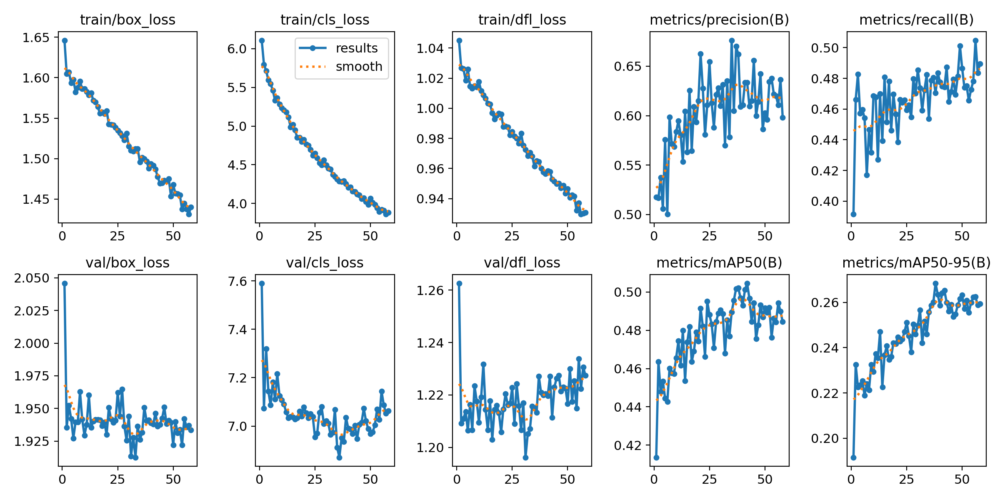

# AI Training Documentation

## Training Data Sources (combined and cleaned):

https://universe.roboflow.com/3d-printer-failure/all_anomalies-rfe61

https://universe.roboflow.com/3d-printer-failure/fdm-w6znp-qnbzd

## Training Python Scripts:

### train_phase1.py - 
```bash
from ultralytics import YOLO

def main():
    model = YOLO("yolov8n.pt")

    model.train(
        data="dataset_combined/data.yaml",
        epochs=70,
        imgsz=640,
        batch=16,
        device=0,
        workers=4,
        optimizer="AdamW",

        # Learning rate
        lr0=0.002,
        lrf=0.01,
        warmup_epochs=3,
        patience=15,

        # Loss balance
        cls=0.4,
        box=7.5,
        dfl=1.0,
        label_smoothing=0.05,

        # Augmentation (Phase 1)
        mosaic=0.8,
        mixup=0.05,
        hsv_h=0.015,
        hsv_s=0.5,
        hsv_v=0.4,
        degrees=6,
        translate=0.08,
        scale=0.45,
        shear=1.5,
        fliplr=0.5,

        # Logging
        project="runs/detect",
        name="phase1_feature_learning",
        exist_ok=True,
    )

if __name__ == "__main__":
    main()
```

### train_phase2.py - 
```bash
from ultralytics import YOLO

def main():
    model = YOLO("runs/detect/phase1_feature_learning/weights/best.pt")

    model.train(
        data="dataset_combined/data.yaml",
        epochs=110,
        imgsz=640,
        batch=16,
        device=0,
        workers=4,
        optimizer="AdamW",

        # Lower LR for fine tuning
        lr0=0.0007,
        lrf=0.05,
        warmup_epochs=2,
        patience=20,

        # Strong class separation
        cls=2.0,
        box=7.5,
        dfl=1.0,
        label_smoothing=0.015,

        # Reduced augmentation (Phase 2)
        mosaic=0.15,
        mixup=0.0,
        hsv_h=0.01,
        hsv_s=0.35,
        hsv_v=0.3,
        degrees=3,
        translate=0.04,
        scale=0.25,
        shear=1.0,
        fliplr=0.5,

        # Logging
        project="runs/detect",
        name="phase2_class_separation",
        exist_ok=True,
    )

if __name__ == "__main__":
    main()

```

## Results:



**mAP@50 Values**:

- All classes: 0.502
<br><br>
- Spaghetti: 0.556
- Blob: 0.626
- Warping: 0.341
- Cracks: 0.485